# Climate-Driven Dengue Risk Framework for Jharkhand, India

A remote sensing and climate analytics pipeline studying the relationship between environmental conditions and dengue transmission suitability across 22 districts of Jharkhand (2010-2023).

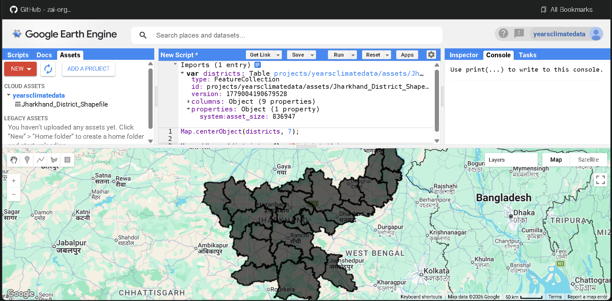

## Overview

This project uses satellite-derived environmental variables to build a district-level climate-health intelligence framework for dengue risk assessment. It combines data from MODIS, CHIRPS, ERA5, SMAP, VIIRS, and JRC to quantify how changing climate conditions influence vector-borne disease ecology across Jharkhand.

### Key Findings

- Statistically significant warming trends detected via Mann-Kendall tests
- Monsoon dynamics (onset, intensity, persistence) strongly drive transmission suitability
- Districts clustered into 4 distinct ecological risk zones
- Composite vulnerability index ranks districts by environmental dengue susceptibility

## Satellite & Climate Data Sources

| Variable | Source | Resolution |
|----------|--------|-----------|
| Land Surface Temperature (Day) | MODIS MOD11A2 | Monthly, District |
| Land Surface Temperature (Night) | MODIS MOD11A2 | Monthly, District |
| Rainfall | CHIRPS | Monthly, District |
| Humidity | ERA5 Reanalysis | Monthly, District |
| NDVI (Vegetation) | MODIS MOD13A2 | Monthly, District |
| Soil Moisture | NASA SMAP | Monthly, District |
| Surface Water | JRC Global Surface Water | Monthly + Static |
| Nighttime Lights | VIIRS | Annual, District |
| Elevation, Slope, Land Use | SRTM + ESA WorldCover | Static, District |

## Remote Sensing Imagery

<p align="center">
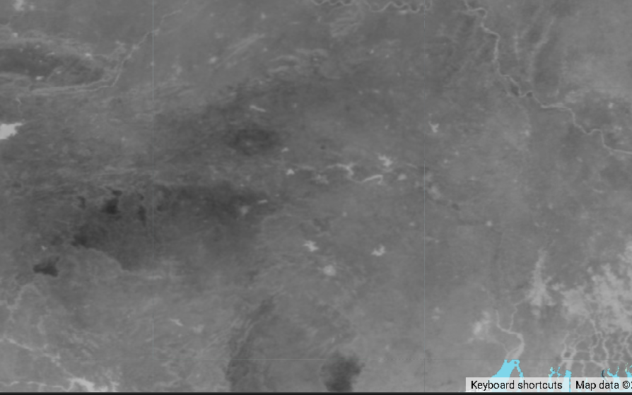

</p>
<p align="center">
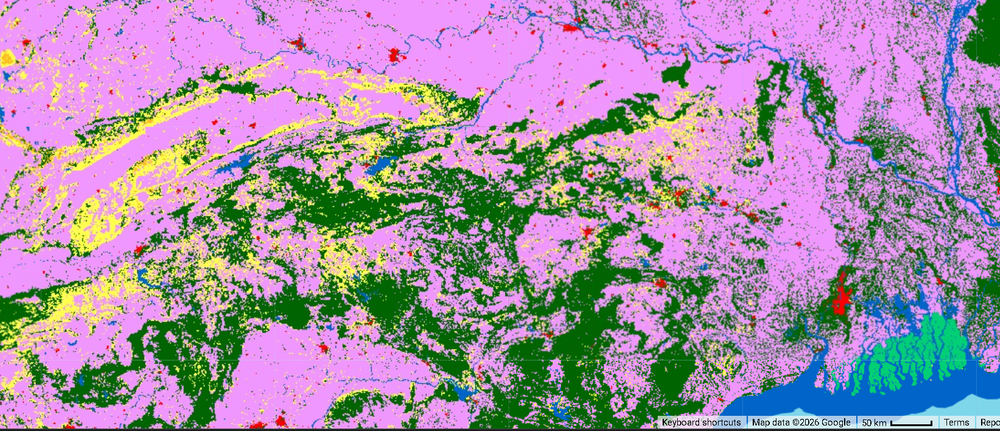
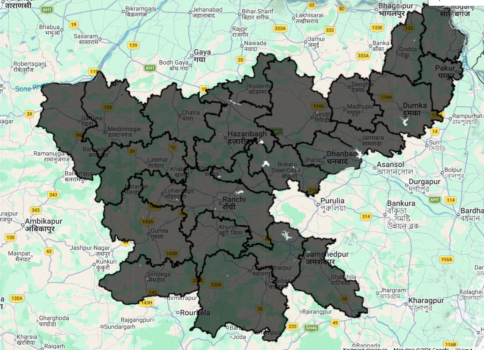
</p>
<p align="center">

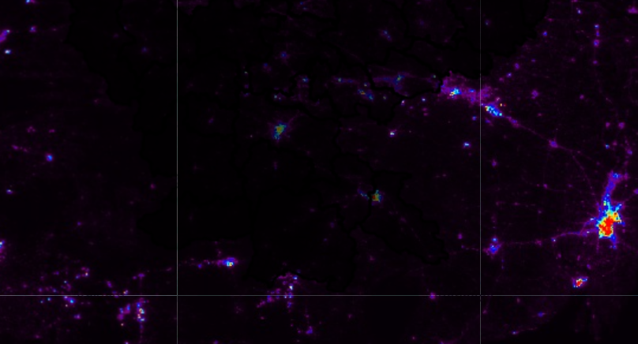
</p>
<p align="center">

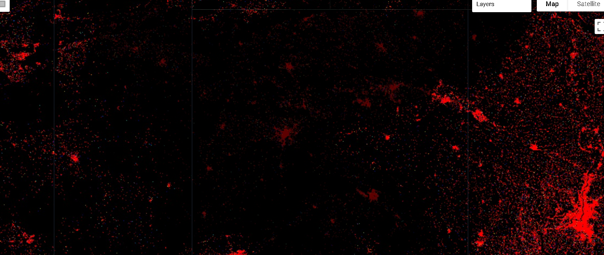
</p>

## Analysis Outputs

### District Environmental Profiles
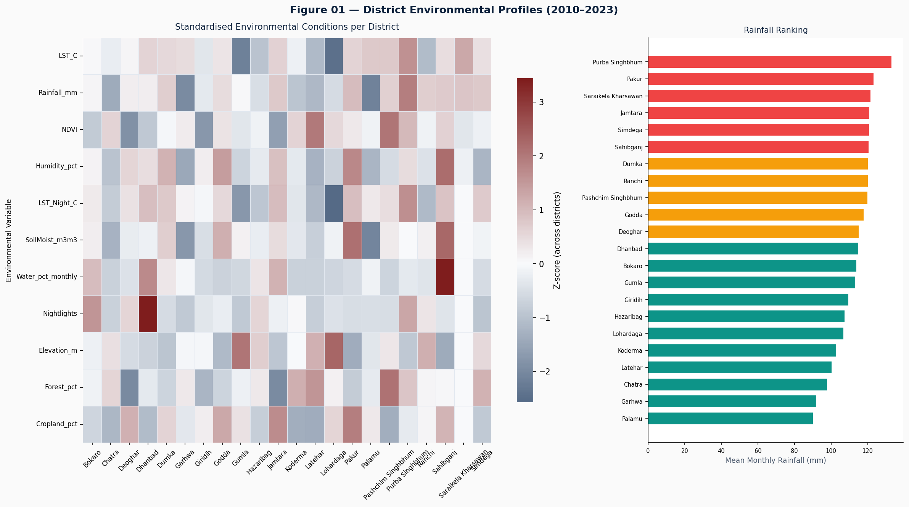

### Temporal Climate Trends (Mann-Kendall)
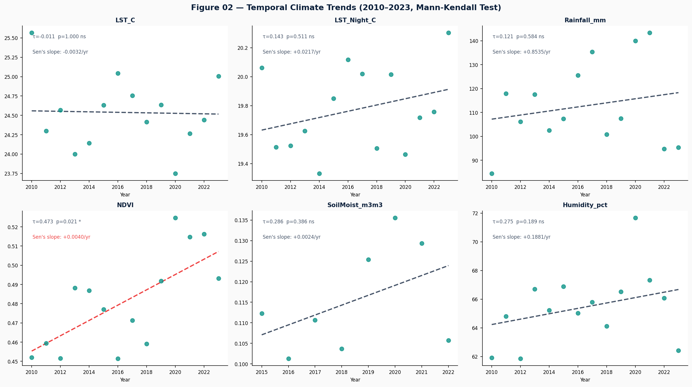

### Monsoon Dynamics & Ecological Response
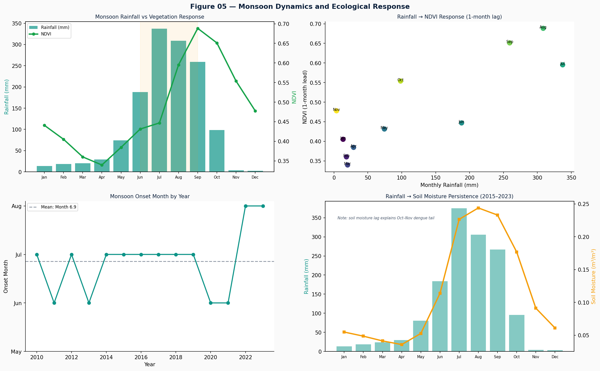

### Ecological Clustering of Districts
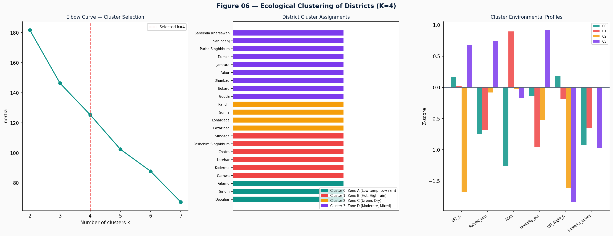

### Climate Vulnerability Index
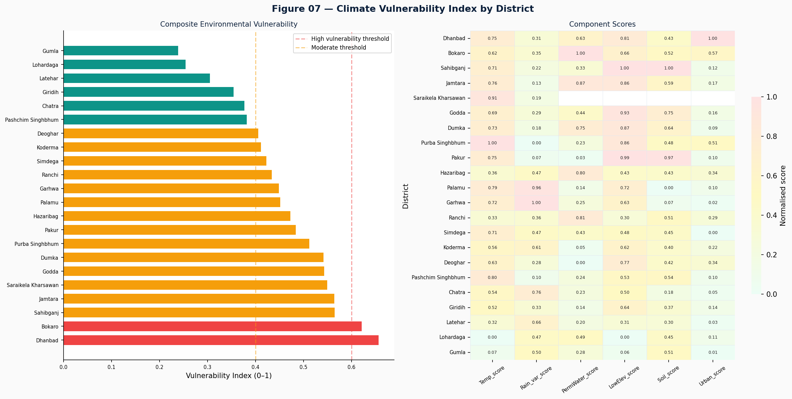

### Transmission Suitability Index (TSI)
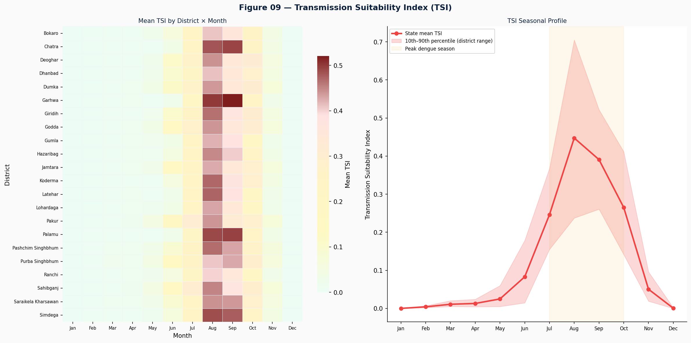

### Night Warming Analysis
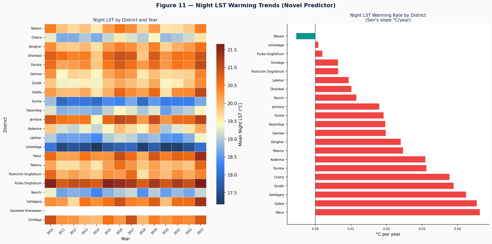

## Pipeline

```
premerge_qc.py          → Data quality control
fix_sentinels.py        → Replace sentinel values (-999) with NaN
merge_extended_features.py → Merge all satellite datasets
postmerge_qc.py         → Validate merged output
feature_engineering.py  → Lag, rolling, seasonal, anomaly features
engineered_qc.py        → Validate engineered features
exploratory_analysis.py → Generate all analysis figures
```

Run the full pipeline:
```bash
python pythonrun_pipeline.py
```

## Project Structure

```
├── data/raw/                  # Raw satellite CSVs (GEE exports)
├── outputs/
│   ├── exploratory_analysis/  # 12 publication-quality figures + CSVs
│   ├── qc/                    # Quality control reports
│   ├── master_features.csv    # Merged environmental panel
│   └── master_features_engineered.csv  # Final feature set
├── StateImages/               # GEE remote sensing visualizations
├── config.py                  # Project configuration
└── pythonrun_pipeline.py      # Master pipeline runner
```

## Study Area

- **State**: Jharkhand, India
- **Districts**: 22
- **Period**: 2010-2023 (14 years, monthly)
- **Panel size**: 3,696 district-month observations
- **Features**: 63 environmental variables (raw + engineered)

## Requirements

```
pandas
numpy
matplotlib
seaborn
scipy
scikit-learn
```

## License

This project is for academic research purposes.
